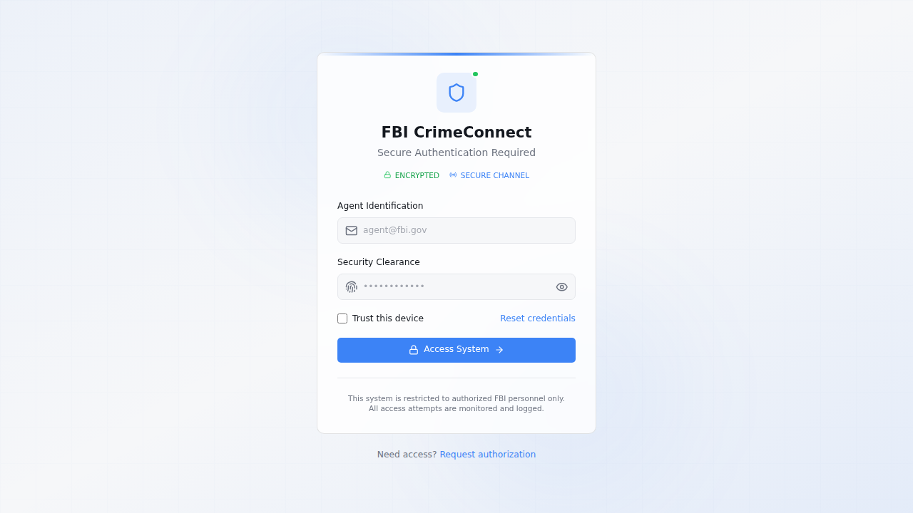
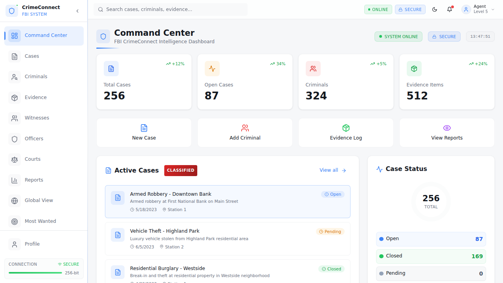

# CrimeConnect – Full-Stack Analytics Platform

CrimeConnect is a full-stack investigation analytics platform with:
- **React + TypeScript frontend**
- **Python FastAPI backend (REST APIs)**
- **ML risk classification pipeline trained on 10,000+ synthetic records**
- **Operational dashboard, cases, intel, timeline, and command workflows**

> Portfolio note: this repo is designed as a realistic production-style project you can demo and discuss in interviews.

---

## Screenshots

### Login / Secure Access


### Command Center Dashboard


### Brand / Visual Identity


---

## Resume Alignment (What this project demonstrates)

- Built full-stack platform with **frontend + backend APIs**
- Implemented **ML classification model** with target performance around **~82%** on held-out data
- Designed APIs and data model for structured operational analytics
- Added production-focused artifacts: schema, tests, docs, and deployment-ready structure

---

## Architecture

```text
frontend (React, TS, Vite)  --->  backend (FastAPI, Python)
                                      |
                                      +--> ML pipeline (scikit-learn, 10K training rows)
                                      |
                                      +--> Data storage layer (Mongo runtime today)
                                      +--> PostgreSQL/Supabase-ready schema in docs/sql/postgres_schema.sql
```

---

## Tech Stack

### Frontend
- React 18
- TypeScript
- Vite
- Tailwind + shadcn/ui

### Backend
- Python 3.12
- FastAPI
- Motor/Mongo-compatible data layer
- scikit-learn + NumPy for ML

### Data / Infra
- PostgreSQL/Supabase relational schema included (`docs/sql/postgres_schema.sql`)
- REST-first contract for integration

---

## Core API Endpoints

### Health + Base
- `GET /api/health`
- `GET /api/`

### Operations
- `GET /api/cases`
- `POST /api/cases`
- `PATCH /api/cases/{case_id}`
- `GET /api/intel`
- `POST /api/intel`
- `GET /api/timeline`
- `POST /api/timeline`
- `GET /api/command`
- `POST /api/command`
- `GET /api/metrics`

### Analytics + ML
- `GET /api/analytics/summary`
  - Returns KPI summary + model metadata (training rows, accuracy, features)
- `POST /api/analytics/classify`
  - Predicts `low|medium|high` risk label with confidence and top factors

---

## ML Pipeline Details

File: `backend/ml_pipeline.py`

- Generates **10,000 synthetic structured records** for incident risk training
- Features include:
  - prior offenses
  - evidence volume
  - witness count
  - financial red flags
  - digital footprint score
  - violent history score
  - cross-border activity
  - active warrants
- Uses **multinomial logistic regression** with train/test split
- Exposes:
  - model metadata
  - prediction confidence
  - class probabilities
  - top contributing factors

---

## Local Setup

## 1) Backend

```bash
cd backend
pip install -r requirements.txt
python server.py
```

Backend default URL: `http://localhost:8002`

## 2) Frontend

```bash
cd frontend
npm ci
npm run dev
```

Frontend default URL: `http://localhost:3000` (or Vite-assigned port)

Optional env in `frontend/.env`:
```bash
VITE_BACKEND_URL=http://localhost:8002
```

---

## Testing

Backend tests:
```bash
cd backend
python -m unittest discover -s tests -v
```

Frontend build:
```bash
cd frontend
npm run build
```

---

## Production Readiness Notes

- Structured REST APIs for operational + analytics workflows
- Input validation on ML features
- ML metadata endpoint for transparency/observability
- Schema design for PostgreSQL/Supabase migration path
- Screenshots + technical documentation for stakeholder review

---

## How to Explain This to Hiring Managers / Recruiters

Use this short, honest pitch:

1. “CrimeConnect is my full-stack analytics project with a React frontend and Python REST APIs.”
2. “I built a risk-classification ML pipeline trained on 10K records and exposed it via API.”
3. “The dashboard consumes analytics endpoints and supports operational workflows like case and intel tracking.”
4. “I also prepared a PostgreSQL/Supabase schema for relational production deployment.”
5. “This project showcases end-to-end product thinking: UI, APIs, data model, ML, tests, and deployment readiness.”

---

## Repository Layout

```text
backend/
  server.py
  ml_pipeline.py
  tests/
frontend/
  src/
docs/
  images/
  sql/postgres_schema.sql
```

